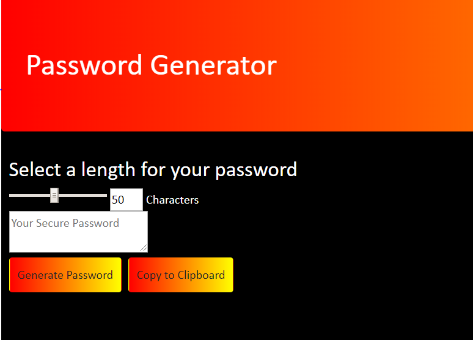

# Password Generator
> This application creates a random password that lets you copy to your clipboard

## Description

This is a application using HTML, CSS and some Javascript, to create a random password for you to copy to your clipboard and use at your leisure.

## Development setup

Simply clone the repo to your local and launch the site. No installation needed.

## Screenshot

## Meta

Nicholas Finch
nicfinch223@gmail.com

[https://github.com/finch23](https://github.com/finch23)

## Contributing

1. Fork it (<https://github.com/yourname/yourproject/fork>)
2. Create your feature branch (`git checkout -b feature/fooBar`)
3. Commit your changes (`git commit -am 'Add some fooBar'`)
4. Push to the branch (`git push origin feature/fooBar`)
5. Create a new Pull Request
